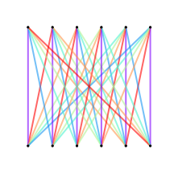

# AutoEquiv

AutoEquiv is a library for implementing *equivariant linear layers* in PyTorch.

The layer constructor `LinearEquiv` takes as arguments a list of generators of the input symmetry group and a corresponding list of generators of the output symmetry group, as well as the number of input and output channels. The use of a bias vector in the layer can be turned off by passing `bias=False` to the constructor.

In AutoEquiv, permutations are specified with a list of destinations. For example `[2, 1, 0]` corresponds to a permutation where element \#0 moves to position \#2, element \#1 stays in place, and  element \#2 moves to position \#0. In other words, the first and last elements are swapped.

## Examples

### Deep Sets

The deep sets layer is a linear layer that is same-equivariant to all permutations. That is, if a permutation is applied to the input, the same permutation will be observed in the output. This layer has two parameters for each (in_channel, out_channel) pair.

One can generate all permutations with the composition of only two permutations: swapping two elements, and a cyclic shift of all elements.


```python
import torch
import autoequiv as ae


set_layer = ae.LinearEquiv(
    in_generators=[
        [3, 0, 1, 2],
        [1, 0, 2, 3]
    ],
    out_generators=[
        [3, 0, 1, 2],
        [1, 0, 2, 3]
    ],
    in_channels=1,
    out_channels=1
)
print('number of parameters in W =', set_layer.num_weights_W)
print('number of parameters in b =', set_layer.num_weights_b)

pretty_tensor = lambda x: ['%+5f' % a for a in x.flatten().tolist()]

x = torch.rand(1, 1, 4)
y = set_layer(x)
print('set_layer(', *pretty_tensor(x), ') =', *pretty_tensor(y))

x = x[:, :, [1, 0, 3, 2]]
y = set_layer(x)
print('set_layer(', *pretty_tensor(x), ') =', *pretty_tensor(y))
```
```
number of parameters in W = 2
number of parameters in b = 1
set_layer( +0.034896 +0.720132 +0.385352 +0.929011 ) = -1.230930 -1.162340 -1.195850 -1.141432
set_layer( +0.720132 +0.034896 +0.929011 +0.385352 ) = -1.162340 -1.230930 -1.141432 -1.195850
```

<br>

```python
import matplotlib.pyplot as plt


fig = plt.figure(figsize=(2, 2))
ae.draw_colored_matrix(set_layer.colors_W)
plt.show()
```

<p align="center">

</p>

```python
fig = plt.figure(figsize=(2, 2))
ae.draw_colored_bipartite_graph(set_layer.colors_W)
plt.show()
```

<p align="center">

</p>


### Cyclic Convolution

Here we consider data that lies on a circle. We'd like a cyclic shift of the input to result in the same cyclic shift of the output, i.e., we'd like translational equivariance. Such a layer will take the form of a convolutional layer. The number of parameters is equal to the number of features.


```python
import torch
import autoequiv as ae


cyc_conv1d = ae.LinearEquiv(
    in_generators=[
        [1, 2, 3, 4, 5, 0]
    ],
    out_generators=[
        [1, 2, 3, 4, 5, 0]
    ],
    in_channels=1,
    out_channels=1
)
print('number of parameters in W =', cyc_conv1d.num_weights_W)
print('number of parameters in b =', cyc_conv1d.num_weights_b)

pretty_tensor = lambda x: ['%+5f' % a for a in x.flatten().tolist()]

x = torch.rand(1, 1, 6)
y = cyc_conv1d(x)
print('cyc_conv1d(', *pretty_tensor(x), ') =', *pretty_tensor(y))

x = x[:, :, [2, 3, 4, 5, 0, 1]]
y = cyc_conv1d(x)
print('cyc_conv1d(', *pretty_tensor(x), ') =', *pretty_tensor(y))
```
```
number of parameters in W = 6
number of parameters in b = 1
cyc_conv1d( +0.590747 +0.250085 +0.167654 +0.626883 +0.542684 +0.964548 ) = -0.641388 -0.753184 -0.648751 -0.755415 -0.443568 -0.683651
cyc_conv1d( +0.167654 +0.626883 +0.542684 +0.964548 +0.590747 +0.250085 ) = -0.648751 -0.755415 -0.443568 -0.683651 -0.641388 -0.753184
```

<br>

```python
import matplotlib.pyplot as plt


fig = plt.figure(figsize=(3, 3))
ae.draw_colored_matrix(cyc_conv1d.colors_W)
plt.show()
```

<p align="center">

</p>

```python
fig = plt.figure(figsize=(3, 3))
ae.draw_colored_bipartite_graph(cyc_conv1d.colors_W)
plt.show()
```

<p align="center">

</p>


### 2nd-Order Set Equivariant Layer

Here we consider interaction data for a single set. Such data can be visualized as a complete graph with features lying on the edges. These features can be represented as a matrix. We'd like a linear layer that will take such a matrix as input and produce another matrix of the same shape. If the rows and columns of the input matrix are permuted by the same permutation, we want the same permutation to be observed in the output.


```python
import torch
import numpy as np
import autoequiv as ae


perm1 = np.arange(5 ** 2).reshape(5, 5)
perm2 = perm1.copy()
        
perm1 = perm1[[1, 2, 3, 4, 0], :]
perm1 = perm1[:, [1, 2, 3, 4, 0]]

perm2 = perm2[[1, 0, 2, 3, 4], :]
perm2 = perm2[:, [1, 0, 2, 3, 4]]

set2_layer = ae.LinearEquiv(
    in_generators=[
        perm1.flatten().tolist(),
        perm2.flatten().tolist()
    ],
    out_generators=[
        perm1.flatten().tolist(),
        perm2.flatten().tolist()
    ],
    in_channels=1,
    out_channels=1
)
print('number of parameters in W =', set2_layer.num_weights_W)
print('number of parameters in b =', set2_layer.num_weights_b)
```
```
number of parameters in W = 15
number of parameters in b = 2
```

<br>

```python
import matplotlib.pyplot as plt


fig = plt.figure(figsize=(10, 10))
ae.draw_colored_matrix(set2_layer.colors_W)
plt.show()
```

<p align="center">

</p>

```python
fig = plt.figure(figsize=(10, 2))
ae.draw_colored_matrix(set2_layer.colors_b)
plt.show()
```

<p align="center">

</p>


We see in the figure above that the bias vector of `set2_layer` has two parameters. One for the diagonal elements of the matrix and one for the off-diagonal elements.


### Icosahedral Layer

Here we consider features that lie on the faces of an icosahedron, or equivalently, on the vertices of a dodecahedron. Symmetries of the icosahedron consist of the rotations that leave the shape unchanged. This symmetry group is isomorphic to the group *A*<sub>5</sub>, the group of even permutations of five objects.


```python
import torch
import autoequiv as ae


icosa_layer = ae.LinearEquiv(
    in_generators=[
        [7, 3, 9, 15, 2, 8, 0, 11, 18, 16, 19, 12, 6, 17, 4, 10, 14, 5, 13, 1],
        [3, 8, 0, 7, 1, 18, 5, 9, 15, 2, 12, 14, 19, 10, 6, 16, 4, 13, 11, 17]
    ],
    out_generators=[
        [7, 3, 9, 15, 2, 8, 0, 11, 18, 16, 19, 12, 6, 17, 4, 10, 14, 5, 13, 1],
        [3, 8, 0, 7, 1, 18, 5, 9, 15, 2, 12, 14, 19, 10, 6, 16, 4, 13, 11, 17]
    ],
    in_channels=1,
    out_channels=1
)
print('number of parameters in W =', icosa_layer.num_weights_W)
print('number of parameters in b =', icosa_layer.num_weights_b)

pretty_tensor = lambda x: ['%+5f' % a for a in x.flatten().tolist()]

x = torch.rand(1, 1, 20)
y = icosa_layer(x)
print('icosa_layer(', *pretty_tensor(x), ') =', *pretty_tensor(y))

x = x[:, :, [7, 3, 9, 15, 2, 8, 0, 11, 18, 16, 19, 12, 6, 17, 4, 10, 14, 5, 13, 1]]
y = icosa_layer(x)
print('icosa_layer(', *pretty_tensor(x), ') =', *pretty_tensor(y))
```
```
number of parameters in W = 8
number of parameters in b = 1
icosa_layer( +0.069927 +0.262705 +0.513318 +0.857511 +0.746046 +0.671902 +0.388892 +0.315838 +0.462556 +0.242755 +0.815133 +0.455972 +0.248889 +0.623835 +0.914860 +0.055149 +0.915804 +0.772107 +0.700368 +0.547416 ) = +0.949630 +1.054453 +0.964606 +0.832586 +0.792364 +0.922518 +0.930833 +1.052033 +0.613014 +0.846307 +0.964214 +0.881313 +0.954861 +0.732831 +0.629384 +1.052299 +0.811820 +0.709391 +0.993768 +1.057232
icosa_layer( +0.315838 +0.857511 +0.242755 +0.055149 +0.513318 +0.462556 +0.069927 +0.455972 +0.700368 +0.915804 +0.547416 +0.248889 +0.388892 +0.772107 +0.746046 +0.815133 +0.914860 +0.671902 +0.623835 +0.262705 ) = +1.052033 +0.832586 +0.846307 +1.052299 +0.964606 +0.613014 +0.949630 +0.881313 +0.993768 +0.811820 +1.057232 +0.954861 +0.930833 +0.709391 +0.792363 +0.964214 +0.629384 +0.922518 +0.732831 +1.054453
```

<br>

```python
import matplotlib.pyplot as plt


fig = plt.figure(figsize=(9, 9))
ae.draw_colored_matrix(icosa_layer.colors_W)
plt.show()
```

<p align="center">

</p>

### DNA Layer

Here we design an equivariant layer for processing circular DNA data (usually found in bacteria). DNA consists of two complementary strands running in opposite directions. In other words, reading the first strand from left to right is equivalent to reading the second strand from right to left. This property is called the reverse-complement symmetry of DNA. The layer we design will receive as input one strand in a predefined direction encoded in a one-hot fashion (in the order, A, T, C, G). With the same principles, one could also design a layer that receives both strands as input for settings were we'd like to process erroneous DNA.


```python
import torch
import numpy as np
import autoequiv as ae


perm1 = np.arange(6 * 4).reshape(6, 4)
perm2 = perm1.copy()
        
perm1 = perm1[[1, 2, 3, 4, 5, 0], :]
perm2 = perm2[:, [1, 0, 3, 2]]
perm2 = perm2[::-1, :]

dna_layer_v1 = ae.LinearEquiv(
    in_generators=[
        perm1.flatten().tolist(),
        perm2.flatten().tolist()
    ],
    out_generators=[
        perm1.flatten().tolist(),
        perm2.flatten().tolist()
    ],
    in_channels=1,
    out_channels=1
)
print('number of parameters in W =', dna_layer_v1.num_weights_W)
print('number of parameters in b =', dna_layer_v1.num_weights_b)

pretty_tensor = lambda x: ['%+5f' % a for a in x.flatten().tolist()]
pretty_bits = lambda x: ['%1.0f' % a for a in x.flatten().tolist()]

x = torch.eye(4)[torch.randint(4, size=(1, 1, 6))].view(1, 1, 6 * 4)
y = dna_layer_v1(x)
print('dna_layer_v1(', *pretty_bits(x), ') =', *pretty_tensor(y))

x = x[:, :, perm1.flatten().tolist()]
x = x[:, :, perm2.flatten().tolist()]
y = dna_layer_v1(x)
print('dna_layer_v1(', *pretty_bits(x), ') =', *pretty_tensor(y))
```
```
number of parameters in W = 48
number of parameters in b = 2
dna_layer_v1( 0 1 0 0 0 0 1 0 0 0 0 1 1 0 0 0 0 0 1 0 0 1 0 0 ) = -0.178477 +0.690301 +0.052323 -0.022996 +0.456126 +0.451133 +0.372025 +0.334484 +0.766735 -0.368428 +0.255716 +0.189640 +0.524680 +0.188722 +0.173870 -0.132527 +0.573256 +0.411164 +0.504575 +0.088636 +0.451318 +0.095778 +0.209507 -0.077439
dna_layer_v1( 0 0 0 1 0 0 1 0 0 1 0 0 0 0 0 1 1 0 0 0 1 0 0 0 ) = +0.451133 +0.456126 +0.334484 +0.372025 -0.368428 +0.766735 +0.189640 +0.255716 +0.188722 +0.524680 -0.132527 +0.173870 +0.411164 +0.573256 +0.088636 +0.504575 +0.095778 +0.451318 -0.077439 +0.209507 +0.690301 -0.178477 -0.022996 +0.052323
```

<br>

```python
import matplotlib.pyplot as plt


fig = plt.figure(figsize=(10, 10))
ae.draw_colored_matrix(dna_layer_v1.colors_W)
plt.show()
```

<p align="center">

</p>

```python
fig = plt.figure(figsize=(10, 2))
ae.draw_colored_matrix(dna_layer_v1.colors_b)
plt.show()
```

<p align="center">

</p>

By using a different ordering for the features we can create a different visualization for the same layer. This can help us better understand the structure of the weight-sharing pattern and to perhaps write a specialized implementation for the layer.


```python
import torch
import numpy as np
import autoequiv as ae


perm1 = np.arange(6 * 4).reshape(4, 6)
perm2 = perm1.copy()
        
perm1 = perm1[:, [1, 2, 3, 4, 5, 0]]
perm2 = perm2[[1, 0, 3, 2], :]
perm2 = perm2[:, ::-1]

dna_layer_v2 = ae.LinearEquiv(
    in_generators=[
        perm1.flatten().tolist(),
        perm2.flatten().tolist()
    ],
    out_generators=[
        perm1.flatten().tolist(),
        perm2.flatten().tolist()
    ],
    in_channels=1,
    out_channels=1
)
```

```python
import matplotlib.pyplot as plt


fig = plt.figure(figsize=(10, 10))
ae.draw_colored_matrix(dna_layer_v2.colors_W)
plt.show()
```

<p align="center">

</p>

```python
fig = plt.figure(figsize=(10, 2))
ae.draw_colored_matrix(dna_layer_v2.colors_b)
plt.show()
```

<p align="center">

</p>

## Notes

* The generated layer may sometimes be equivariant to a larger group. In such cases, one has no choice but to change the set on which the group is acting.
* This implementation is very general, and therefore, it may not be the most efficient implementation possible for many layers. This library is useful for finding the weight-sharing pattern and prototyping. It can also be useful in cases where a highly efficient implementation does not seem to exist.

## Requirements

`torch` and `numpy` are core requirements.
Other requirements are `matplotlib` and `pylab` if you are plotting matrices, and `networkx` if you want to plot graphs.

## TODOs

* Implement sparse layers. The current implementation only supports dense layers (every input feature is connected to every output feature).
